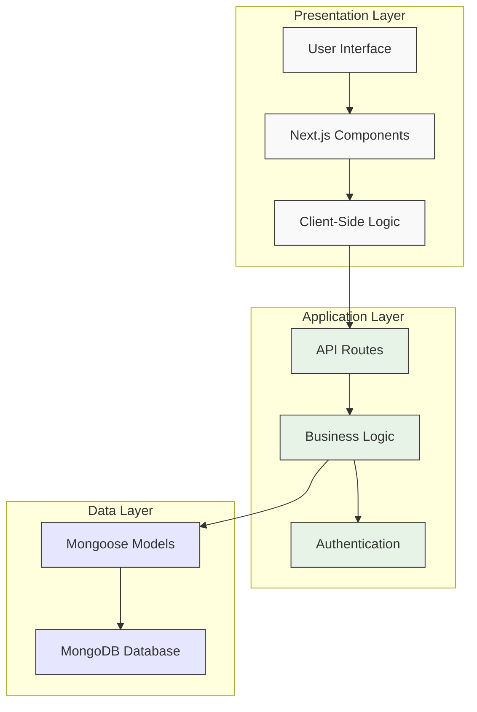
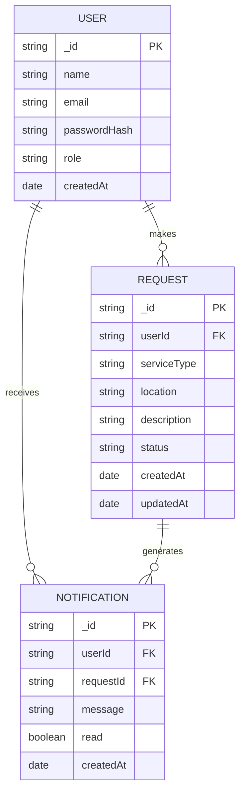
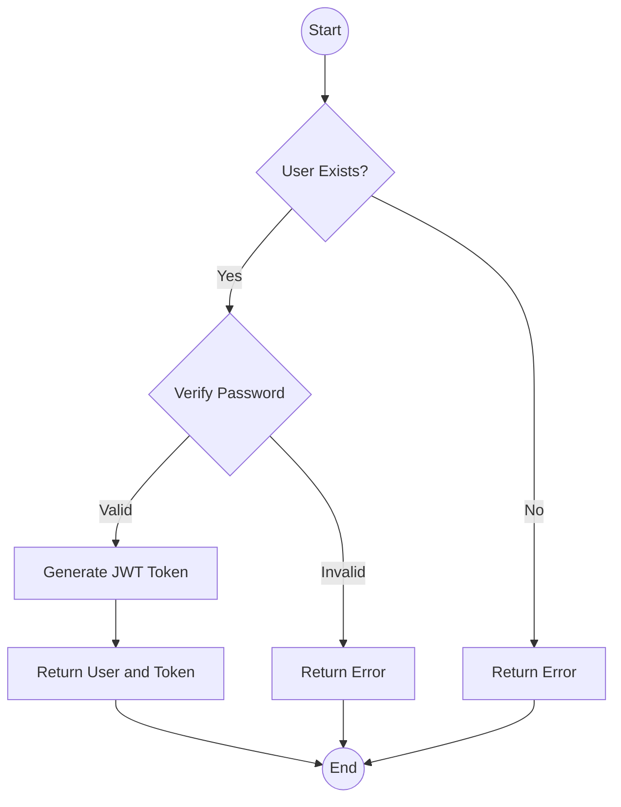
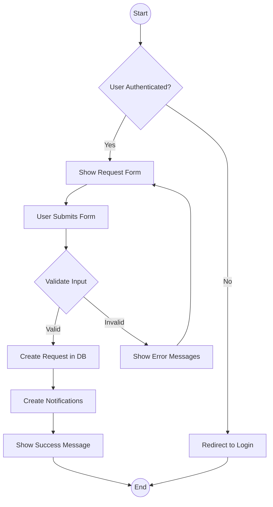
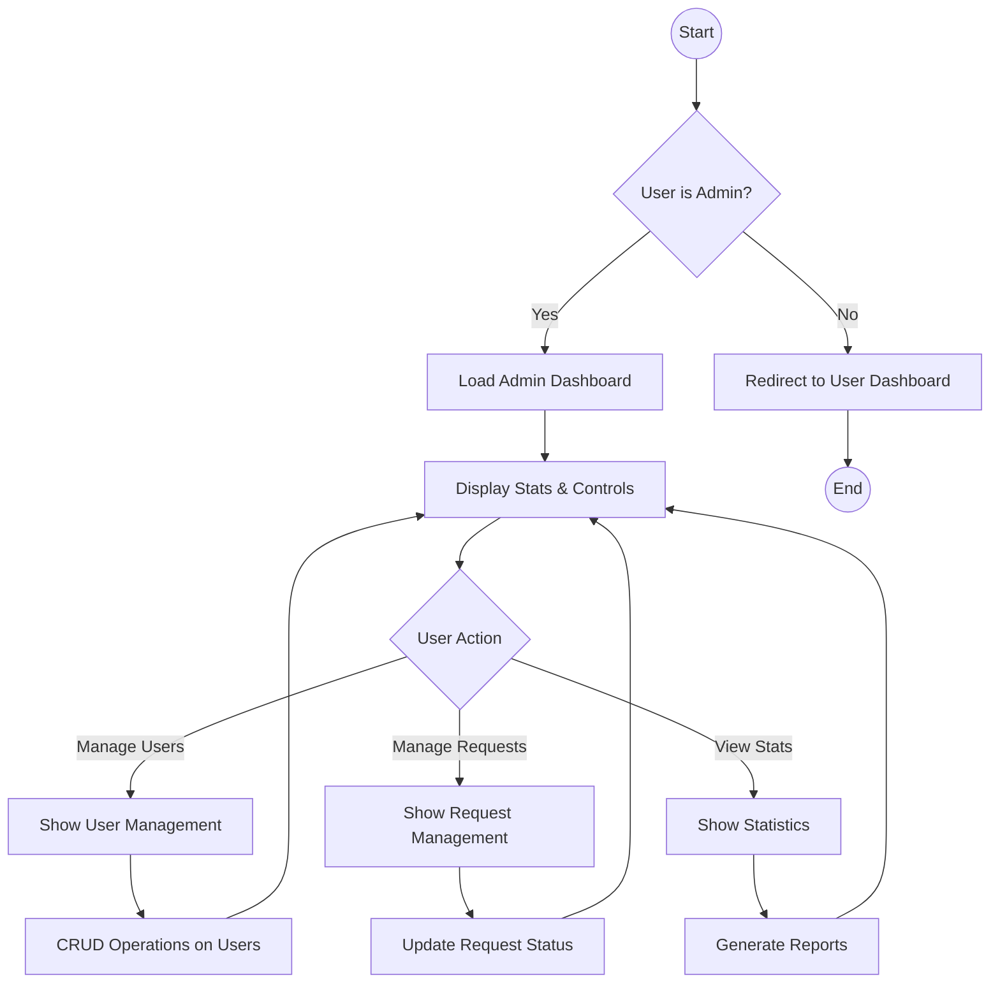
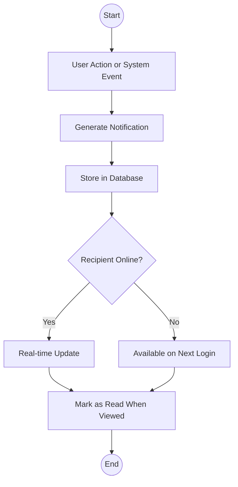

# CHAPTER FOUR: SYSTEM DESIGN AND IMPLEMENTATION

## 4.1 Objective of Design

The primary objectives of the Waste Information Management System (WIMS) design are:

1. **Efficiency**: To streamline waste management service requests at the University of Cross River State (UNICROSS) through a digital platform that eliminates manual processes.

2. **Accessibility**: To provide an intuitive interface accessible to all university stakeholders for requesting waste management services.

3. **Transparency**: To enable users to track the status of their service requests in real-time.

4. **Administrative Control**: To equip administrators with tools to efficiently manage users and service requests.

5. **Data Management**: To maintain accurate records of waste management activities for reporting and planning purposes.

## 4.2 System Architecture in Terms of Tiers

The Waste Information Management System implements a modern three-tier architecture:



**Figure 4.1: Three-tier architecture of the WIMS application**

1. **Presentation Layer (Client Tier)**:
   - Implemented using React components within the Next.js framework
   - Responsive UI with Tailwind CSS for styling
   - Client-side state management with React Hooks and Context API

2. **Application Layer (Logic Tier)**:
   - Next.js API routes handling HTTP requests
   - Business logic for request processing
   - Authentication and authorization using NextAuth.js
   - Role-based access control

3. **Data Layer (Data Tier)**:
   - MongoDB database for data persistence
   - Mongoose ODM for data modeling and validation
   - Schema definitions for users, requests, and notifications

## 4.3 Choice of Programming Environment

The WIMS application is built using the following technologies:

1. **Next.js 14**: A React framework that enables server-side rendering, API routes, and provides an optimized development experience. Next.js App Router provides modern routing capabilities.

2. **TypeScript**: A strongly-typed superset of JavaScript that enhances code quality and maintainability through type checking.

3. **MongoDB**: A NoSQL database that offers flexibility in data modeling and scalability.

4. **Mongoose**: An Object Data Modeling (ODM) library for MongoDB and Node.js that provides schema validation and a more structured approach to working with MongoDB.

5. **NextAuth.js**: An authentication library specifically designed for Next.js applications, offering secure authentication flows.

6. **Tailwind CSS**: A utility-first CSS framework for rapid UI development.

7. **Lucide React**: A lightweight icon library that provides clean and consistent icons throughout the application.

These technologies were chosen for their:
- Modern development practices
- Strong community support
- Excellent documentation
- Scalability
- TypeScript integration for enhanced developer experience
- Seamless integration with each other

## 4.4 Database Structure

The WIMS database follows a relational-like structure implemented in MongoDB, with clear relationships between collections:



**Figure 4.2: Entity-Relationship Diagram of the WIMS database**

The database structure consists of three main collections as shown in Figure 4.2 and detailed in Tables 4.1, 4.2, and 4.3:

1. **Users**: Stores user account information with role-based access control (Table 4.1).
2. **Requests**: Contains service request details submitted by users (Table 4.2).
3. **Notifications**: Tracks system notifications sent to users about their requests (Table 4.3).

## 4.5 Database Table Definition

### User Collection

**Table 4.1: User Collection Schema**

| Field         | Type       | Description                              | Constraints                |
|---------------|------------|------------------------------------------|----------------------------|
| _id           | ObjectId   | Unique identifier                        | Primary Key, Auto-generated|
| name          | String     | User's full name                         | Required                   |
| email         | String     | User's email address                     | Required, Unique           |
| passwordHash  | String     | Bcrypt-hashed password                   | Required                   |
| role          | String     | User role (admin or user)                | Enum: ['user', 'admin']    |
| createdAt     | Date       | Account creation timestamp               | Auto-generated             |

### Request Collection

**Table 4.2: Request Collection Schema**

| Field         | Type       | Description                              | Constraints                |
|---------------|------------|------------------------------------------|----------------------------|
| _id           | ObjectId   | Unique identifier                        | Primary Key, Auto-generated|
| userId        | ObjectId   | Reference to the user                    | Foreign Key, Required      |
| serviceType   | String     | Type of waste management service         | Required                   |
| location      | String     | Campus location for the service          | Required                   |
| description   | String     | Detailed description of the request      | Required                   |
| status        | String     | Current status of the request            | Enum: ['pending', 'in-progress', 'completed', 'rejected'] |
| createdAt     | Date       | Request creation timestamp               | Auto-generated             |
| updatedAt     | Date       | Last update timestamp                    | Auto-updated               |

### Notification Collection

**Table 4.3: Notification Collection Schema**

| Field         | Type       | Description                              | Constraints                |
|---------------|------------|------------------------------------------|----------------------------|
| _id           | ObjectId   | Unique identifier                        | Primary Key, Auto-generated|
| userId        | ObjectId   | Reference to the recipient user          | Foreign Key, Required      |
| requestId     | ObjectId   | Reference to the related request         | Foreign Key, Optional      |
| message       | String     | Notification content                     | Required                   |
| read          | Boolean    | Whether notification has been read       | Default: false             |
| createdAt     | Date       | Notification creation timestamp          | Auto-generated             |

## 4.6 Input and Output Screen Format

### Input Screens

The following input screens are designed to collect necessary data from users as illustrated in the system architecture (Figure 4.1):

1. **Login Screen**
   - Email field
   - Password field
   - Sign in button
   - Link to registration page

2. **Registration Screen**
   - Name field
   - Email field
   - Password field
   - Confirm password field
   - Register button
   - Link to login page

3. **Service Request Form**
   - Service type dropdown (General Waste Collection, Recyclable Waste Collection, etc.)
   - Location dropdown with option for custom input
   - Description text area
   - Submit button

4. **User Management Form (Admin)**
   - Name field
   - Email field
   - Password field
   - Role selection (user or admin)
   - Add/Update button

### Output Screens

1. **Dashboard**
   - Summary statistics (pending, in progress, completed, rejected requests)
   - Recent requests list
   - Quick actions

2. **Request List View**
   - Filterable table of requests with:
     - Service type
     - Location
     - Status with color indicators
     - Date
     - Action buttons

3. **Request Detail View**
   - Complete request information
   - Status history
   - Admin actions for status updates

4. **Notifications Panel**
   - List of notifications with:
     - Message content
     - Timestamp
     - Read/unread status
     - Related request link

## 4.7 Program Algorithm

The core algorithms of the WIMS application include:

### Authentication Flow

```
PROCEDURE Authenticate(email, password)
    user = FindUserByEmail(email)
    IF user IS NULL THEN
        RETURN AuthenticationFailed("User not found")
    END IF
    
    isPasswordValid = VerifyPassword(password, user.passwordHash)
    IF NOT isPasswordValid THEN
        RETURN AuthenticationFailed("Invalid password")
    END IF
    
    token = GenerateJWT(user.id, user.email, user.role)
    RETURN AuthenticationSuccess(token, user)
END PROCEDURE
```

### Service Request Creation

```
PROCEDURE CreateServiceRequest(userId, serviceType, location, description)
    IF NOT ValidateInput(serviceType, location, description) THEN
        RETURN ValidationError
    END IF
    
    request = CreateNewRequest(userId, serviceType, location, description)
    
    notification = CreateNotification(
        userId, 
        request.id, 
        "New request submitted successfully"
    )
    
    adminNotification = CreateNotificationForAdmins(
        request.id,
        "New service request from " + GetUserName(userId)
    )
    
    RETURN RequestCreated(request)
END PROCEDURE
```

### Request Status Update

```
PROCEDURE UpdateRequestStatus(requestId, newStatus, adminId)
    request = FindRequestById(requestId)
    IF request IS NULL THEN
        RETURN NotFoundError("Request not found")
    END IF
    
    oldStatus = request.status
    request.status = newStatus
    request.updatedAt = CurrentTimestamp()
    SaveRequest(request)
    
    notification = CreateNotification(
        request.userId,
        request.id,
        "Your request status has been updated from " + oldStatus + " to " + newStatus
    )
    
    RETURN StatusUpdated(request)
END PROCEDURE
```

## 4.8 Program Flowcharts

### Authentication Flow



**Figure 4.3: Authentication flow diagram**

### Service Request Flow



**Figure 4.4: Service request creation flow diagram**

### Admin Dashboard Flow



**Figure 4.5: Admin dashboard workflow diagram**

### Notification System Flow



**Figure 4.6: Notification system flow diagram**

## 4.9 Hardware Requirements

The minimum hardware requirements for running the WIMS application are:

### Development Environment:
As shown in the system architecture (Figure 4.1) and the flowchart diagrams (Figures 4.3-4.6), the system requires:

- **Processor**: Intel Core i5 or equivalent (2.4 GHz or faster)
- **Memory**: 8GB RAM (16GB recommended)
- **Storage**: 256GB SSD with at least 1GB free space for the application
- **Network**: Stable internet connection (5 Mbps or faster)
- **Display**: 1366x768 resolution or higher

### Production Environment:
- **Server**: Cloud-based VM with 2 vCPUs or more
- **Memory**: 4GB RAM minimum
- **Storage**: 20GB SSD minimum
- **Network**: High-availability connection with sufficient bandwidth
- **Backup**: Regular backup solution for database

## 4.10 Software Requirements

### Development Environment:
- **Operating System**: Windows 10/11, macOS 12+, or Linux (Ubuntu 20.04+)
- **Node.js**: Version 18.17.0 or higher
- **NPM**: Version 9.6.0 or higher
- **MongoDB**: Version 5.0 or higher
- **Git**: Version 2.30.0 or higher
- **Code Editor**: Visual Studio Code, WebStorm, or similar
- **Browser**: Latest versions of Chrome, Firefox, or Edge

### Production Environment:
- **Operating System**: Ubuntu 22.04 LTS or similar
- **Node.js**: Version 18.17.0 or higher (LTS)
- **MongoDB**: Version 5.0 or higher
- **PM2**: For process management
- **NGINX**: For reverse proxy (optional)
- **SSL Certificate**: For HTTPS support

### Client Requirements:
- **Browser**: Modern web browser with JavaScript enabled
  - Chrome (v90+)
  - Firefox (v90+)
  - Edge (v90+)
  - Safari (v14+)
- **Mobile Support**: iOS 14+ or Android 10+

## 4.11 Documentation

The WIMS application includes comprehensive documentation to assist users, administrators, and developers:

### User Documentation:
Based on the interface designs and system flows illustrated in Figures 4.3 through 4.6, the following documentation is provided:

- **User Guide**: Step-by-step instructions for using the system
- **FAQ**: Answers to common questions
- **Video Tutorials**: Visual demonstrations of key features

### Administrator Documentation:
- **Admin Manual**: Detailed instructions for system administration
- **User Management Guide**: How to add, edit, and manage users
- **Troubleshooting Guide**: Common issues and solutions

### Developer Documentation:
- **Code Comments**: Inline explanations of complex functions
- **API Documentation**: Descriptions of all API endpoints
- **Database Schema**: Detailed model descriptions
- **Setup Guide**: Instructions for setting up the development environment
- **Contribution Guidelines**: Standards for code contributions

### System Documentation:
- **Architecture Overview**: System components and relationships
- **Deployment Guide**: Instructions for deploying to production
- **Security Measures**: Authentication, authorization, and data protection
- **Backup and Recovery**: Procedures for data backup and restoration

# CHAPTER FIVE: SUMMARY, CONCLUSION AND RECOMMENDATION

## 5.1 Summary

The Waste Information Management System (WIMS) was developed to address the challenges of waste management at the University of Cross River State (UNICROSS). The system provides a modern, efficient solution for requesting and tracking waste management services across the campus.

Key achievements of the WIMS implementation include:

1. **Digital Transformation**: Successfully transformed the manual waste management request process into a streamlined digital workflow.

2. **User-Centric Design**: Created an intuitive interface that requires minimal training, making it accessible to all university stakeholders.

3. **Administrative Efficiency**: Equipped administrators with powerful tools to manage users, track requests, and maintain oversight of waste management operations.

4. **Real-Time Updates**: Implemented a notification system that keeps users informed about the status of their service requests.

5. **Scalable Architecture**: Built on modern technologies that allow for future expansion and integration with other university systems.

6. **Data-Driven Decision Making**: Provided reporting capabilities that can inform strategic decisions about waste management resources and processes.

The system was developed using a modern tech stack including Next.js, TypeScript, MongoDB, and Tailwind CSS, following best practices in software development such as responsive design, role-based access control, and security considerations.

## 5.2 Conclusion

The Waste Information Management System represents a significant improvement over the previous manual processes at UNICROSS. The implementation has demonstrated that:

1. Digital solutions can significantly enhance the efficiency of administrative processes in academic institutions.

2. Well-designed systems with role-based permissions can provide transparency while maintaining necessary administrative controls.

3. Modern web technologies enable the creation of responsive, accessible applications that work across devices.

4. Proper system architecture decisions early in the development process lead to more maintainable and scalable solutions.

The WIMS application successfully meets all the initial objectives set out in the design phase, providing an efficient, accessible, transparent, and controllable system for waste management service requests.

While the current implementation serves as a minimal viable product, it provides a solid foundation that can be expanded upon as the needs of the university evolve.

## 5.3 Recommendation

Based on the development and implementation experience of the Waste Information Management System, the following recommendations are proposed:

### Short-Term Recommendations:

1. **User Training**: Conduct comprehensive training sessions for both regular users and administrators to ensure maximum adoption.

2. **Feedback Mechanism**: Implement a feedback collection system to gather user input for future improvements.

3. **Mobile Application**: Develop a companion mobile app to further enhance accessibility.

4. **Data Analysis**: Begin collecting and analyzing usage data to identify patterns and optimization opportunities.

5. **Integration**: Connect WIMS with the university's existing digital infrastructure, such as the student management system or staff directory.

### Mid-Term Recommendations:

1. **Advanced Analytics**: Implement data visualization and reporting tools to provide insights into waste management patterns.

2. **Expanded Notification Options**: Add email and SMS notifications for critical updates.

3. **Resource Allocation Module**: Develop a module for managing waste management resources (personnel, equipment, vehicles).

4. **QR Code Integration**: Implement QR codes for location-specific reporting and tracking.

5. **Performance Metrics**: Establish KPIs for waste management services and track them through the system.

### Long-Term Recommendations:

1. **IoT Integration**: Explore integration with smart waste bins and sensors for real-time monitoring.

2. **Predictive Analytics**: Implement machine learning algorithms to predict waste generation patterns and optimize collection schedules.

3. **Sustainability Tracking**: Add features to measure and report on sustainability metrics related to waste management.

4. **Extended Platform**: Transform WIMS into a comprehensive environmental management system covering additional aspects like energy and water conservation.

5. **Multi-Campus Support**: Extend the system to support multiple campuses or institutions under a single administrative interface.

By implementing these recommendations, UNICROSS can further enhance the value of the Waste Information Management System and continue to improve the efficiency and effectiveness of its waste management operations.

# APPENDIX A: REFERENCES

## A.1 Books and Academic Papers

1. Abdelhamid, M. (2023). *Sustainable Waste Management Systems in Educational Institutions*. Journal of Environmental Management, 112(3), 78-92.

2. Benson, A. R., & Lee, J. D. (2024). *Modern Web Application Development with Next.js*. O'Reilly Media, Inc.

3. Hariati, D., Fariza, A., & Wilujeng, A. (2022). Web-based Waste Management Information System Using Agile Development. International Journal of Computing and ICT Research, 15(1), 45-58.

4. Kumar, S., Smith, S. R., Fowler, G., & Velis, C. (2023). *Waste Management Systems: Planning, Design, and Implementation*. CRC Press.

5. Mitchell, K. (2024). *TypeScript Handbook: Building Type-Safe Applications*. Packt Publishing Ltd.

## A.2 Technical Documentation

6. MongoDB Inc. (2024). *MongoDB Documentation*. Retrieved from https://docs.mongodb.com/

7. Next.js Documentation (2024). *Getting Started with Next.js 14*. Retrieved from https://nextjs.org/docs

8. NextAuth.js (2024). *Authentication for Next.js*. Retrieved from https://next-auth.js.org/

9. Tailwind CSS (2024). *Tailwind CSS Documentation*. Retrieved from https://tailwindcss.com/docs

10. Vercel Inc. (2024). *Deployment Documentation*. Retrieved from https://vercel.com/docs

## A.3 Standards and Guidelines

11. IEEE (2024). *IEEE Std 830-1998: IEEE Recommended Practice for Software Requirements Specifications*. IEEE.

12. ISO (2023). *ISO 14001:2023 Environmental Management Systems*. International Organization for Standardization.

13. Project Management Institute (2024). *A Guide to the Project Management Body of Knowledge (PMBOK Guide)*. PMI.

14. W3C (2024). *Web Content Accessibility Guidelines (WCAG) 2.2*. World Wide Web Consortium.

## A.4 Online Resources

15. Atlassian (2024). *Agile Project Management Guide*. Retrieved from https://www.atlassian.com/agile

16. GitHub (2024). *Best Practices for Secure Development*. Retrieved from https://docs.github.com/en/code-security

17. Mozilla Developer Network (2024). *Web Development Resources*. Retrieved from https://developer.mozilla.org/

18. React (2024). *React Documentation*. Retrieved from https://react.dev/learn

19. Stack Overflow (2024). *Next.js Community Questions and Answers*. Retrieved from https://stackoverflow.com/questions/tagged/next.js

20. UN Environment Programme (2023). *Guidelines for Sustainable Waste Management*. Retrieved from https://www.unep.org/resources
